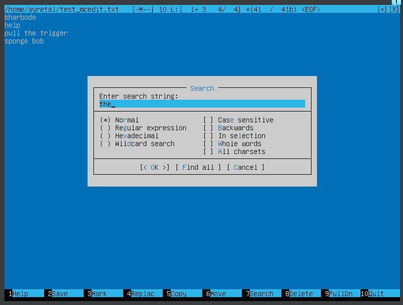
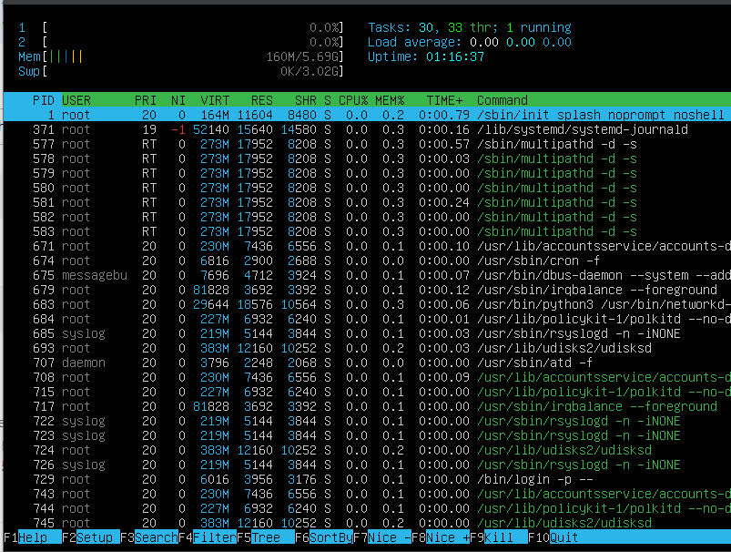

## Part 1. Установка ОС
версию Ubuntu

## Part 2. Создание пользователя
Создание пользователя, отличного от созданного при установке

вывод команды cat /etc/passwd

Пользователь добавлен в группу adm

## Part 3. Настройка сети ОС
посмотреть текущее имя пользователя через hostnamectl

меняем имя пользователя через sudo hostnamectl set-hostname новое_имя

также через sudo vi /etc/hosts меняем имя

устанавливем московское время через ln -sf /usr/share/zoneinfo/Europe/Moscow /etc/localtime 

выведем названия сетевых интерфейсов через ip -br link show

Интерфейс loopback (lo) в операционной системе Linux представляет собой виртуальный сетевой интерфейс, который позволяет устройству обращаться к себе самому, обеспечивая внутреннюю обратную связь (loopback)
Использование интерфейса lo помогает управлять локальными соединениями и обеспечивает локальное тестирование

enp0s3 ― сетевой адаптер Ethernet

получим ip адрес устройства, на котором работаю, от DHCP сервера используя hostname -I

Определим и выведем на экран внешний ip-адрес шлюза (ip) и внутренний IP-адрес шлюза, он же ip-адрес по умолчанию (gw).

внутренний ip-адрес шлюза - 127.0.0.1 и маска /8

внешний ip-адрес шлюза (ip) - inet 10.0.2.15/24 — IP-адрес.

Рядом с ним маска /24 - т.е. в моём случае адрес сети - 10.0.2.0, броадкаст - 10.0.2.255(широковещательный канал, широковещание (англ. broadcasting) — метод передачи данных в компьютерных сетях, при котором поток данных (каждый переданный пакет в случае пакетной передачи) предназначен для приёма всеми участниками сети), а диапазон адресов - от 1 до 254. Чуть ниже строка inet6 - это IP адрес по IPv6.

Задай статичные (заданные вручную, а не полученные от DHCP сервера) настройки ip, gw, dns (используй публичный DNS серверы, например 1.1.1.1 или 8.8.8.8).

Используя sudo vim /etc/netplan/00-installer-config.yaml задаем наши параметры

Пингуется 

## Part 4. Обновление ОС

обновим через sudo update и sudo upgrade

## Part 5. Использование команды sudo

Sudo означает SuperUser DO и используется для доступа к файлам и операциям с ограниченным доступом. По умолчанию Linux ограничивает доступ к определенным частям системы, предотвращая компрометацию конфиденциальных файлов. Команда sudo временно повышает привилегии, позволяя пользователям выполнять конфиденциальные задачи без входа в систему как пользователь root.

Даём разрешение пользователю NewUser на использование sudo.

Поменяем hostname ОС от имени пользователя, созданного в пункте Part 2 (используя sudo);

## Part 6. Установка и настройка службы времени

## Part 7. Установка и использование текстовых редакторов

#### VIM

для выхода с сохранением :wq

для выхода без сохранения :q!

функция поиска по содержимому файла

замена слова на любое другое

#### NANO

для выхода с сохранением ^O + ^X

для выхода без сохранения ^X

функция поиска по содержимому файла ^W

замена слова на любое другое "^ и обратный слэш"

#### MCEDIT

для выхода с сохранением F2 and F10

для выхода без сохранения F10

функция поиска по содержимому файла F7

замена слова на любое другое F4

## Part 8. Установка и базовая настройка сервиса SSHD
установка:

    sudo apt install openssh-server
подключение автозагрузки:

    sudo systemctl enable ssh
    systemctl status ssh

настроим:

    sudo nano /etc/ssh/sshd-config

порт:

#### ps
(processes status — статус процессов) — это встроенная утилита Unix/Linux для просмотра информации, касающейся выбора запущенных процессов в системе: она считывает эту информацию из виртуальных файлов в файловой системе /proc. Это одна из важных утилит для системного администрирования, особенно в рамках мониторинга процессов, чтобы помочь вам понять, что происходит в системе Linux.

В выводе присутствует четыре столбца:

    PID: идентификационный номер процесса.
    TTY: имя консоли, на которой пользователь выполнил вход.
    TIME: количество времени центрального процессора, которое потребил процесс.
    CMD: имя команды, которая запустила процесс

    ps опции
    $ ps опции | grep параметр

Во втором варианте мы используем утилиту grep для того, чтобы отобрать нужные нам процессы по определенному критерию. Теперь рассмотрим опции утилиты. Они делятся на два типа - те, которые идут с дефисом Unix и те, которые используются без дефиса - BSD. Лучше пользоваться только опциями Unix, но мы рассмотрим и одни и другие. Заметьте, что при использовании опций BSD, вывод утилиты будет организован в BSD стиле.

    -A, -e, (a) - выбрать все процессы;
    -a - выбрать все процессы, кроме фоновых;
    -d, (g) - выбрать все процессы, даже фоновые, кроме процессов сессий;
    -N - выбрать все процессы кроме указанных;
    -С - выбирать процессы по имени команды;
    -G - выбрать процессы по ID группы;
    -p, (p) - выбрать процессы PID;
    --ppid - выбрать процессы по PID родительского процесса;
    -s - выбрать процессы по ID сессии;
    -t, (t) - выбрать процессы по tty;
    -u, (U) - выбрать процессы пользователя.

Опции форматирования:

    -с - отображать информацию планировщика;
    -f - вывести максимум доступных данных, например, количество потоков;
    -F - аналогично -f, только выводит ещё больше данных;
    -l - длинный формат вывода;
    -j, (j) - вывести процессы в стиле Jobs, минимум информации;
    -M, (Z) - добавить информацию о безопасности;
    -o, (o) - позволяет определить свой формат вывода;
    --sort, (k) - выполнять сортировку по указанной колонке;
    -L, (H)- отображать потоки процессов в колонках LWP и NLWP;
    -m, (m) - вывести потоки после процесса;
    -V, (V) - вывести информацию о версии;
    -H - отображать дерево процессов;

Вводим 

    ps -e | grep sshd

перезагрузка:

    sudo systemctl restart sshd
вывод команды netstat -tan

-tan: t - отображает список TCP соединений, a - показывает все (активные и слушающие) соединения, n - отображает числовые IP адреса и порты вместо их доменных имен.

Значение каждого столбца в выводе: tcp - протокол, 0 - PID процесса, управляющего соединением (обычно 0, так как это слушающий порт), 0 - UID пользователя, связанного с соединением, 0.0.0.0:2022 - локальный адрес и порт слушающего сокета, 0.0.0.0:* - внешний адрес и порт слушающего сокета, LISTEN - состояние соединения (в данном случае порт слушает входящие соединения).

## Part 9. Установка и использование утилит top, htop

- По выводу команды top определи:
  - uptime (18:04:04 up 59 min)
  - количество авторизованных пользователей (1 user)
  - общую загрузку системы (load average 0.07, 0.02, 0.00)
  - общее количество процессов (106 total, 1 running, 103 sleeping, 2 stopped, 0 zombie)
  - загрузку cpu (0.2 us)
  - загрузку памяти (MiB Mem 156.7 used)
  - pid процесса занимающего больше всего памяти (PID1 systemd)
  - pid процесса, занимающего больше всего процессорного времени (PID1 systemd)

- Cкрин с выводом команды htop:
  - отсортированному по PID, PERCENT_CPU, PERCENT_MEM, TIME

  - отфильтрованному для процесса sshd

  - с процессом syslog, найденным, используя поиск 

  - с добавленным выводом hostname, clock и uptime

## Part 10. Использование утилиты fdisk

    sudo fdisk -l

название жесткого диска VBOX HARDDISK

его размер 31.28 Gb

количество секторов 65583648

 

    free -h 

размер swap 3.0G

 

## Part 11. Использование утилиты df

##### Запустим команду df
 
  - размер раздела (149966280)
  - размер занятого пространства (5942136)
  - размер свободного пространства (8270580)
  - процент использования (42%)
  - Единицы измерения в выводе - байты

##### Запустим команду df -Th.
 
- Для корневого раздела (/):
    - размер раздела (15G)
    - размер занятого пространства (5.7G)
    - размер свободного пространства (7.9G)
    - процент использования (42%)
- Тип файловой системы для раздела - ext4

## Part 12. Использование утилиты du
Запустим команду du

## Part 13. Установка и использование утилиты ncdu

sudo apt install ncdu

## Part 14. Работа с системными журналами

    vim /var/log/dmesg

    vim /var/log/syslog

    vim /var/log/auth.log

    sudo systemctl restart ssh
    sudo grep "sshd*" /var/log/auth.log

    sudo grep "session opened" /var/log/auth.log

Последняя успешная авторизация - Feb 6 20:21:26

Имя пользователя - user-1

Метод входа - локальный вход, с исползованием логина и пароля под правами root

## Part 15. Использование планировщика заданий CRON
##### Используя планировщик заданий, запусти команду uptime через каждые 2 минуты.

    sudo crontab -e

удаляем через 
    sudo crontab -r

